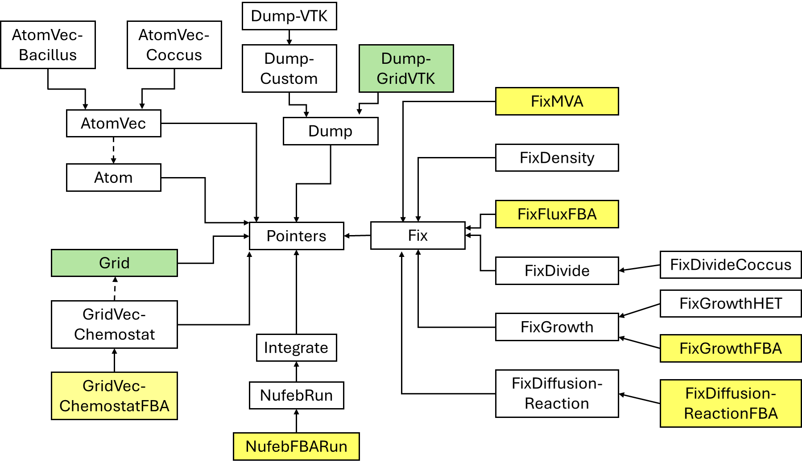

# Design Documentation 

## NUFEB Governing Equations (HET Example)

### Pysical processes

The net force acting on particle $i$ is given by

$$
  m_i \frac{d \mathbf{v}_{i}}{dt} = \mathbf{F}_{c,i} + \mathbf{F}_{a,i} + \mathbf{F}_{d,i} + \cdots
$$

where $m_i$ is the particle mass, $\mathbf{v}_i$ its velocity, $\mathbf{F}_c$ the contact force, $\mathbf{F}_a$ the EPS adhesive force, and $\mathbf{F}_d$ the drag force.


(Contact Force) The contact force is a pairwise interaction modeled with Hooke’s law:

$$
  \mathbf{F}_{c,i} = \sum_{j=1}^{N_i} \left( K_n \delta n_{i,j}\mathbf{n}_{i,j} - m_{i,j}\gamma_n \mathbf{v}_{i,j} \right),
$$

where $N_i$ is the number of neighbors of particle $i$, $K_n$ the normal elastic constant, $\delta n_{i,j}$ the normal overlap distance, $m_{i,j} = \tfrac{m_i m_j}{m_i+m_j}$ the effective mass of particles $i$ and $j$, $\gamma_n$ the damping constant for normal contact, and $\mathbf{v}_{i,j}$ their relative velocity.

(EPS Adhesive Force) The EPS-mediated adhesion is modeled as a van der Waals interaction:

$$
  \mathbf{F}_{a,i} = \sum_{j=1}^{N_i} \frac{H_a r_{i,j}}{12 h_{min,i,j}^2}\,\mathbf{n}_{i,j},
$$

where $H_a$ is the Hamaker coefficient, $r_{i,j}$ the effective outer radius of the pair, $h_{min,i,j}$ their minimum separation distance, and $\mathbf{n}_{i,j}$ the unit vector pointing from $i$ to $j$.

(Drag Force) The drag force $\mathbf{F}_{d,i}$, arising from fluid–particle interactions and opposing microbial motion in the fluid, is given by

$$
  \mathbf{F}_{d,i} = \frac{V_{p,i}}{\epsilon_{f,i}\epsilon_{s,i}}\, \beta_i \big(\mathbf{u}_{p,i} - \mathbf{U}_{f,i}\big),
$$

with $\epsilon_{s,i}$ the solid volume fraction, $\epsilon_{f,i} = 1 - \epsilon_{s,i}$ the fluid volume fraction, $V_{p,i}$ and $\mathbf{u}_{p,i}$ the volume and velocity of particle $i$, and $\beta_i$ the drag correction coefficient.

#### Fluid Dynamics Approximation

To model fluid flow, particle velocities are averaged within each voxel. The incompressible continuity condition is

$$
  \nabla \cdot \left(\epsilon_s \mathbf{U}_s + \epsilon_f \mathbf{U}_f\right) = 0,
$$

while the momentum balance is

$$
  \frac{\partial(\epsilon_f \mathbf{U}_f)}{\partial t} 
  + \nabla \cdot (\epsilon_f \mathbf{U}_f \mathbf{U}_f)
  = \frac{1}{\rho_f}\Big(-\nabla P + \epsilon_f \nabla \cdot \mathcal{R} + \epsilon_f \rho_f \mathbf{g} + \mathbf{F}_f\Big),
$$

where $\epsilon_s$, $\mathbf{U}_s$, and $\mathbf{F}_f$ are the solid volume fraction, solid velocity, and solid–fluid interaction forces, respectively. Here $\rho_f$ denotes fluid density, $\nabla P$ the pressure gradient, $\mathcal{R}$ the divergence of the stress tensor, and $\mathbf{g}$ gravitational acceleration.

### Chemical Processes

Nutrient transport is governed by a diffusion–advection–reaction model:

$$
  \frac{\partial S}{\partial t} = \nabla \cdot (D \nabla S) - \nabla \cdot (\hat{v}S) + R,
$$

where $S$ is the nutrient concentration, $D$ the diffusion coefficient, $\hat{v}$ the fluid velocity, and $R$ the reaction term. The reaction term is described using Monod kinetics:

$$
  R_i = \mu_i \left( \frac{1}{Y_i} \, Cat_i + Ana_i \right) X,
$$

with $\mu_i$ the microbial growth rate, $Y_i$ the maximum yield, $Cat_i$ the free energy supplied by catabolic reactions, $Ana_i$ the free energy required for anabolic reactions, and $X$ the biomass density.


### Biological Processes

Microbial growth is modeled exponentially:

$$
  \frac{d m_i}{dt} = \mu_i m_i,
$$

where $m_i$ is the microbial biomass and $\mu_i$ the growth rate, which can be determined using either Monod-based or energy-based formulations. Cell division occurs once the cell diameter exceeds a user-specified threshold.

Extracellular polysaccharide (EPS) is produced exclusively by heterotrophs. Initially, EPS accumulates as an outer shell surrounding a heterotrophic (HET) particle. When the relative thickness of this shell surpasses a threshold, approximately half of the EPS mass (with a uniformly random ratio between 0.4 and 0.6) is released as a separate EPS particle, which is then placed randomly in the vicinity of the parent HET.


## Small NUFEB Software Architecture
.png)

`LAMMPS`: The LAMMPS class contains pointers of all constituent class instances and global variables that are used by a LAMMPS simulation. Its contents represent the entire state of the simulation.

Individual agents are modeled as atoms, in which the properties of each atom is stored as a vector. For memory efficiency, instead of creating an object for each atom and its properties, a single `Atom` and `AtomVec` object is created such that the $i^{th}$ atom's property is stored in the $i^{th}$ index of the array. 

1. `Atom`: This class provides access to atom data, in particular atom style related global settings and per-atom data that is stored with atoms and migrates with the atoms from sub-domain to sub-domain. (NOTE: Actual per atom data is allocated and managed by one of the various classes derived from `AtomVec` class as determined by the `atom_style`)
2. `AtomVec`: An abstract class that contains the per-atom data. Conatins methods for communication, data packing/unpacking and memory management.
3. `AtomVecBacillus`: Stores information for a Bacillus-shaped particle. It has an array of `Bonus` (a struct) that each stores quaternion (`quat`), inertia tensor (`inertia`), coordinates of the two poles (`pole1`, `pole2`), length (`length`), (`diameter`) and the local index (`ilocal`). 
4. `AtomVecCoccus`: Stores information for a coccus-shaped particle. Contains information arrays for radius (`radius`), mass (`rmass`), biomass (`biomass`), radius with EPS shell (`outer_radius`), mass with EPS shell (`outer_mass`) and mechanical properties for DEM (`omega` which is an array). 

Continuous fields, such as external solute concentrations, are implemented in a grid, where values at each lattice point represents the mean value of the voxel. Similar to individual agents, a single `Grid` and `GridVec` object is created where arrays in `GridVec` are maintained to store the properties of each grid-cell in a way where the $i^{th}$ grid-cell property is stored at the $i^{th}$ index of the array. 

1. `Grid`: Represents a spatial grid in which data is stored in a `GridVec`. Its attributes include the style of the grid (`grid_style`), number of grid cells (`ncells`) and flags for periodic boundaries in the x,y & z direction. 
2. `GridVec`: An abstract class that reprsents vector data tied to grid cells in the simulation and provides an interface for communication and data exchange. 
3. `GridVecChemostat`: A concrete implementation of `GridVec` class to represent a chemostat conditions. Contains properties such as concentration values for each substrate in each grid cell (`double** conc`), reaction rates for each substrate in each grid cell (`double** reac`), density values for each atom group in each grid cell (`double** dens`), growth rate for each atom group in each grid cell for each atom type (HET & EPS) (`double*** growth`), bulk concentrations for each grid cell (`double** bulk`), molecular weight in g/mol for each substrate (`double* mw`), boundary conditions for each substrate in each (-x,+x,-y,+y,-z,+z) direction (`int** boundary`), diffusion coefficients for each substrate in each grid-cell (`double** diff_coeff`), pH conditions for each grid-cell (`double* ph`) and the activity of substrate form for microbe uptake in each grid-cell (`double* act`). 

[Pair styles](https://docs.lammps.org/pair_style.html) in LAMMPS are used to compute the pairwise interactions between atoms, in particular, they define the pair potentials between pairs of atoms that are within a cutoff distance from each other. 

1. `PairGranHooke` ('gran/hooke'): Models the frictional force between two granular particles when the distance between their centroids  $r$ is smaller than the sum of their radii $d=R_i+R_j$, that is is $r<d$. There is no force between the particles when $r>d$. [[LAMMPS doc](https://docs.lammps.org/pair_gran.html)]

2. `PairGranHookeHistory` (`gran/hooke/history`): in addition to the `gran/hooke` pairstyle, this model accounts the tangential displacement between the particles for the duration of the time they are in contact that is given by the shear force and dubbed a "histroy" effect.  [[LAMMPS doc](https://docs.lammps.org/pair_gran.html#pair-style-gran-hooke-history-command)]


Updates to the underlying model are handled by `Fix` class. The methods of these classes are called every class specific time-step in the loop. 
1. `Fix`: Abstract class that provides an interface for updates to the simulation during specific timesteps. `char* id` and `char* style` are identifiers for the fix instance. `int igroup` and `int groupbit` define the group of atoms that the fix affects. `int nevery` specifies how often to call an `end_of_step` fix. The `setmask()` method must be implemented to specify when the fix is applied. (Mask must be one of the enum in `FixConst` of `Fix.h` file)

2. `FixDivide`: Abstract `Fix` class that provides an interface for splitting of particle that is applied at `POST_NEIGHBOR` and would cause reneighboring of the particles after the splitting. Reauires children to implement `compute()`.
3. `FixDivideCoccus`: Concrete class of `FixDivide` for coccus-shaped bacteria.

4. `FixGrowth`: Abstract `Fix` class that provides an interface for the growth of bacteria applied at `BIOLOGY_NUFEB` and `CHEMISTRY_NUFEB`. Requires children to implement `update_atoms()` and `update_cells()`.
5. `FixGrowthHET`: Concrete class of `FixGrowth` for HET bacteria group.

6. `FixDensity`: Updates the density (`grid->dens`) of each atom group for each grid-cell and is applied at `POST_PHYSICS_NUFEB`. [They took (total biomass) * (total rmass) / (cell volume)?] 

7. `FixDiffusionCoeff`: Updates the diffusion coefficient for each substrate in each grid-cell (`grid->diffusion_coeff`) using one of two methods (`RATIO` or `DYNAMICS`). This is applied at `POST_PHYSICS_NUFEB`. 

8. `FixDiffusionReaction`: Updates the concentration of each substrate in each grid-cell (`grid->conc`). It has a `compute_scalar()` implemented that computes the maximum relative change in concentration across the grid-cells. [ I don't understand why `mask` is set to 0 ]

9. `FixNVE` (`nve`): Plain time integration to update the position and velocity for the atoms. [[LAMMPS doc](https://docs.lammps.org/fix_nve.html)]

10. `FixNVELimit` (`nve/limit`): In addition to the `FixNVE`, this fix imposes a limit on the maximum distance a particle can move in a single time step. [[LAMMPS doc](https://docs.lammps.org/fix_nve_limit.html)]

11. `FixViscous` (`viscous`): Adds a viscous damping force that is proportional in magnitude to the velocity of the atom but in the opposite direction, that is $F_d = -\gamma v$. [[LAMMPS doc](https://docs.lammps.org/fix_viscous.html)]


## Conversion [icell] to grid-coordinates [ix,iy,iz]
`grid->subbox[w]` represents the number of grid cells in the `w` direction. To convert a volume to an array, cells are stacked by the `x`, `y` then `z`, so 

  `icell` = `ix` + `iy` * `subbox[0]` + `iz` * `subbox[0]` * `subbox[1]`

To convert `icell` to grid coordinates
  * `ix` = `icell` % `subbox[0]`
  * `iy` = ((`icell` - `ix`) / `subbox[0]`) % `subbox[1]`
  * `iz` = (`icell` - `ix` - `iy` * `subbox[0]`) / (`subbox[0]` * `subbox[1]`) 

Note that the boundary masks of a domain are one cell beyond the domain and are ghost cells. These are maintained to compute more accurate finite differences. The masks for the boundaries of the original simulation domain are denoted `<X/Y/Z>_<N/P>B_MASK`. The boundary type of the biofilm domain is segregated into the usual X/Y/Z boundaries (`BIOFILM_<X/Y/Z><N/P>B_MASK`) and the fluid boundary `BIOFILM_FB_MASK`. Similarly, they are one grid cell beyond the simulation boundary.  

# NUFEB FBA extension Documentation

## Mathematical model

We model the extracellular molecule concentration as a continuous field using diffusion-reaction models. The dynamics of the $i$ extracellular molecule concentration $C_i$ is modeled as  
$$
\frac{\partial C_i}{\partial t} = D_i (\nabla^2 C_i) - \frac{1}{V_{grid}} \sum_{species~j} \nu^{(j)}_i M^{(j)}
$$
where $D$ is the diffusion coefficient, $V_{grid}$ is the volume of the grid cell, $\nu^{(j)}_i$ is the metabolic flux of the $j^{th}$ species for the $i^{th}$ extracellular molecule and $M^{(j)}$ is the total biomass of the bacteria of species $j$. The dynamics for the extracellular molecule concentration is simulated within the chemistry module for a given flux that is assumed constant during the simulation of the module. 

Given the new extracellular concentration, we then compute a new bound on the metabolic flux of the exchanged molecules between the inter- and extra-cellular space. The computation of the bound is dependent on the transport mode across the cell membrane 
$$
\nu \le 
\begin{cases}
  v_{max} \frac{C}{K + C} &,\text{ for facillated diffusion}\\
  \frac{p A C}{M} &,\text{ for passive diffusion}
\end{cases}
$$
where $v_{max}$ is the maximum transport rate across the cell, $K$ is the michaelis-menten constant, $p$ is the permeability of the cell, $A$ is the total surface area of the bacteria species in the grid-cell. The bound is updated within the post-physics module and a new flux distrbution is computed using Flux Balance Analysis (FBA). 

We treat the biomass flux from the FBA as the exponential growth rate and update the biomass of the bacteria cell within the biological module using 
$$
M \leftarrow (1+\nu_{bio}) M
$$

## Class Extensions




As this extension is purely biochemical in nature, we tried our best to not modify the `atom` and `atomvec` class, as result we did not perform any extensions on them. In the above diagram, classes in yellow are newly added and classes in green has been modified from the previous NUFEB version. Solid arrows in the class diagram indicate inheritance (tail inherits from head) while dotted arrows indicate dependencies (tail depends on head).

`GridVecChemostatFBA`: this class extends `GridVecChemostat` to include the following attributes
* `tot_mass`: total biomass of the bacteria in the grid cell with array index [igroup][icell]
* `tot_vol`: total volume of the bacteria in the grid cell with array index [igroup][icell]
* `tot_area`: total surface area of the bacteria in the grid cell with array index [igroup][icell]
* `fluxes`: Metabolic fluxes of the exchange molecules (these are the chemical substrates whose concentration is recorded in the grid cell) with array index [isub][igroup][icell]
*  `biomass_fluxes`: Biomass flux/growth rate of the bacteria in that grid cell with array index [igroup][icell]
*  `trans_mech`: Indicated the transport mechanism of the molecule across the cell membrane of the bacteria with array indexing [isub][igroup]. Simple diffusion (1) and facillated diffusion (2)
*  `permeation`: Permeability of the bacteria cell membrane to the molecule, with array index [isub][igroup]. Left as 0 if not tranported via passive diffusion. 
* `k_t`: Michealis-menten constant for the transport of molecule across the cell membrane with array index [isub][igroup]. Left as 0 if not transported via facillated diffusion
* `v_max`: Maximum facillated diffusion transport rate of molecule across cell membrane with array index [isub][igroup]. Left as 0 if not transported via facillated diffusion. 

`NufebFBARun`: Extends `NufebRun` to perform `fix MVA` and `fix flux FBA` within the post-physical module. 

`FixMVA`: Updates the total bacteria mass, volume and surface area within the post-physical module. If this is not defined, an instance for each particle group would be defined is a NufebFBARun instance is used to integrate. 

`FixFluxFBA`: Performs the FBA within the post-physical module
* `compute`: updates constaints, solve LP and update grid values for all cells
* `update_constraints(int icell)`: Updates the bounds of the exchange fluxes based on the extracellular concentration at the grid cell [icell]
* `solve_lp()`: applies simplex algorithm to solve the linear programe in FBA
*  `update_grid(int icell)`: update the exchange fluxes at the grid cell [icell]
* `read_sbml_file(char * fpath)`: reads the sbml file that has the genome scale model
* `populate_lp()`: sets up the linear programe constraints for FBA after sbml file has been read in
* `set_LP_obj()`: sets the linear programe objective function for FBA after sbml file has been read in

`fixGrowthFBA`: Updates the atoms `rmass` and `radius` using the biomass flux computed from FBA `grid->biomass_fluxes`

`fixDiffusionReactionFBA`: Updates the concentration using an Euler timestep for based on the transport mechanism and exchange flux of the molecule across each bacteria. 

## Commands

`grid_style nufeb/chemostat/fba <n> <molecule name 1> ... <molecule name n> <grid length>`: 
* `<n>` is the number, an integer, of extracellular molecules whose concentration are stored in the grid
* `<molecule name i>` name of the molecule and should match the ID field of the species in the GEM
* `<grid length>` is the length a grid cell. The dimensions of the entire simulation box should be a multiple of this length

`grid_modify set <molecule name> <x bnd> <y bnd> <z bnd> <init conc> <kw-vals> ...`:
* `<molecule name>`: name of the molecule that should match that specified in `grid_style` command
* `<x/y/z bnd>`: two alphabet (`p/n/d`) boundary conditions. Refer to [NUFEB documentation](https://nufeb.readthedocs.io/en/master/grid_modify.html)
* `<init conc>`: Initial concentration of the extracellular molecule at the grid points. Refer to [NUFEB documentation](https://nufeb.readthedocs.io/en/master/grid_modify.html)
* `<kw-vals> ...`: list of keyword value pairs. In addition to `mw` and `bulk` specified in [NUFEB documentation](https://nufeb.readthedocs.io/en/master/grid_modify.html), we added
  * `simple_diff <group ID> <permeability>`: where `<group ID>` is the atom group ID and `<permeability>` is a float value representing permeability parameter in simple diffusion
  * `fac_diff <group ID> <v_max> <K>`: where `<group ID>` is the atom group ID, `<v_max>` is the maximum transport rate in facillated diffusion and `<K>` is the Michealis constant in facillated diffusion

`fix <fix ID> <group ID> nufeb/flux_fba <sbml fpath> <molecule name 1> ... <molecule name n>`:
* `<fix ID>`: string ID of the fix
* `<group ID>`: ID of the group of atoms to apply the fix on
* `<sbml fpath>`: filepath to a valid SBML file containing the GEM
* `<molecule name i>`: name of the molecule and should match the ID field of the species in the GEM

`fix <fix ID> <group ID> nufeb/diffusion_reaction_fba <molecule name> <diffusion coeff>`:
* `<fix ID>`: string ID of the fix
* `<group ID>`: ID of the group of atoms to apply the fix on
* `<molecule name>`: name of the molecule to apply the diffusion on 
* `<diffusion coeff>`: diffusion coefficient of the molecule

`fix <fix ID> <group ID> nufeb/growth/fba`:
* `<fix ID>`: string ID of the fix
* `<group ID>`: ID of the group of atoms to apply the fix on

`fix <fix ID> <group ID> nufeb/mva`:
* `<fix ID>`: string ID of the fix
* `<group ID>`: ID of the group of atoms to apply the fix on


## Data File

### Header Format 
* `atoms`: Number of atoms in the system
* `atom types`: Number of atom types in the system
* `bacilli`: Number of bacilli in the system
* `xlo xhi`: Simulation box boundaries in the x direction
* `ylo yhi` : Simulation box boundaries in the y direction
* `zlo zhi` : Simulaiton box boundaries in the z direction

### Body: Atoms section 
One line per atom with the following syntax

`bacillus atom-ID atom-type bacillusflag density x y z`

`coccus atom-ID atom-type diameter density x y z outer_diameter`

where 
* `atom-ID` : integer ID of atom
* `atom-type` : type of atom (1-Ntype)
* `bacillusflag` : 1 for bacillus particles
* `density` : density of particle (kg/m3)
* `diameter` : diameter of coccus or width of bacillus (m)
* `outer_diameter` : outer_diameter of coccus
* `x,y,z` : coordinates of atom (m)

## Obstacles

One could specify a [region](https://docs.lammps.org/region.html#) in the simulation domain using the LAMMPS region command

```region ID style args keyword arg ...```

* `ID` : User assigned name for the region
* `style` : One of `delete`, `block`, `cone`, `cylinder`, `ellipsoid`, `plane`, `prism`, `sphere`, `union` or `intersect`.
    * `block` args : `xlo xhi ylo yhi zlo zhi`
    * `cone` args : `dim c1 c2 radlo radhi lo hi`
    * `cylinder` args : `dim c1 c2 radius lo hi`
    * `ellipsoid` args : `x y z a b c`
    * `plane` args : `px py pz nx ny nz`
    * `prism` args : `xlo xhi ylo yhi zlo zhi xy xz yz`
    * `sphere` args : `x y z radius`
    * `union` args : `N reg-ID1 reg-ID2 ...`
    * `intersect` args : `N reg-ID1 reg-ID2 ...`
  * zero or more keyword/arg pairs may be appended
    * `side value` : `in` or `out`. (NB in setting an obstacle, we expect the particles to be outside)
    * `units value` : `lattice` or `box`
    * `move` args : `v_x v_y v_z`
    * `rotate` args : `v_theta Px Py Pz Rx Ry Rz`
    * `open` value : integer from 1-6 corresponding to face index

To simulate contact forces, ie to create walls, at the boundaries of the regions, use the [fix wall/region command](https://docs.lammps.org/fix_wall_region.html). 

```fix ID group-ID wall/region region-ID style args ... cutoff```
* `region-ID` : region whose boundary will act as wall
* `style` : One of `lj93`, `lj126`, `lj1043`, `colloid`, `harmonic` or `morse`
* args for `lj93`, `lj126`, `lj1043`, `colloid` and `harmonic`:
    * `epsilon` : strength factor for wall-particle interaction (energy or energy/distance^2 units)
    * `sigma` : size factor for wall-particle interaction (distance units)

## CLI Commands

### Thirdparty Software
The FBA extension requires GLPK and LibSBML thirdparty packages to be dynamically linked. To install them, change directory into thirdparty 
1. `cd /thirdparty`
2. run install for GLPK: `./install-glpk.sh`
3. run install for LibSBML: `./install-libsbml.sh`


### Building NUFEB Programme
The following occurs when one runs `install.sh`, 
  1. Copy files from `/src` & `/lib` over to `lammps_stable_23Jun2022/src` & `lammps_stable_23Jun2022/lib`. (`/src` contains the `.cpp` and `.h` files, while the `/lib` folder contains the `Makefile`s)
  2. Set the relevant `Makefile.lammps` (Tells compiler where to look during dynamic linking)
  3. `make` the compiled programme
  4. Move programme to root directory for convenience `mv lmp_mpi $root_dir/nufeb_mpi`

### Running an Example
To run a simulation, whose parameters are defined by a LAMMPS script `Inputscript.nufeb`, pass the input script as an argument to NUFEB programme `nufeb_mpi`
```
cd examples/biofilm-heterotroph
mpirun -np 4 ../../nufeb_mpi -in Inputscript.nufeb
```

# Lattice Boltzmann Fluid Dynamics

## Mathematics of LBM
At each lattice point $x$ at time $t$, we maintain a discrete velocity direction $i$ and update using the BGK collision term
$$f_i(x+c\delta t, t+\delta t) = f_i(x,t) + \frac{\Delta t}{\tau} [f_i(x,t) - f_i^{eq}(x,t)]$$
where the equilibrium velocity distribution is approximated as 
$$f_i^{eq} = \omega_i \rho \left(1+\frac{u\cdot c_i}{c_s^2} + \frac{(u\cdot c_i)^2}{2c_s^4} + \frac{u\cdot u}{2c_s^2}\right)$$


The simulation algorithm is then proceeds in four big steps
1. Density and momentum density update
    $$\rho(x,t) = \sum_i f_i(x,t)$$
    $$\rho(x,t)u(x,t) = \sum_i c_i f_i(x,t)$$
2. Compute new equilibrium $f$ for each new position and direction
    $$f_i^{eq} = \omega_i \rho \left(1+ \frac{u\cdot c_i}{c_s^2} + \frac{(u\cdot c_i)^2}{2c_s^4} + \frac{u\cdot u}{2c_s^2}\right)$$
3. Compute collision
    $$f^*_i(x,t) = f_i(x,t) - \frac{\Delta t}{\tau} (f_i(x,t) - f^{eq}_i(x,t))$$
4. Apply streaming 
    $$f_i(x+c_i\Delta t) = f^*_i(x,t)$$

## Code Implementation

### Data Structures
We maintain vectorized velocity (`u_x`, `u_y`, `u_z`), pressure (`pressure`) and distribution (`f`) memory arrays. `u_x`, `u_y`, `u_z` & `pressure` are indexed by grid coordinates where the value at grid coordinate $(x,y,z)$ is at the index $$z (N_y \times N_x) + y(N_x) + x$$, where $N_z, N_y, N_x$ are the number of grid cells along the $z,y,x$ coordinate axis respectively. `f` is indexed by 4 tuple, where the value in direction $q$ at $(x,y,z)$ is at the index $$q (N_z\times N_y\times N_x) + z (N_y \times N_x) + y (N_x) + x$$. 

### Classes
1. `Fix Fluids`: Applies the LBM algorithm detailed above on the simultion till convergence (uniform sense) or a maximum iteration number is hit. The syntax is 
```
fix <Fix-ID> <group-ID> nufeb/fluids <tau> <vel in> <rho-out>
```

2. `GridVecChemostatFluid`: Maintains the data structures `u_x`, `u_y`, `u_z` and `pressure`. Also manages how they are packed and unpacked into buffers for MPI communication. Syntax is the same as GridVecChemostat
```
grid_style nufeb/chemostat/fluid <nsubs> <sub1> ... <subn> <scale>
```
where `<scale>` is the scale factor between mesh grid and simulation box.

3. `CommGridFluid`: Manages the MPI communication between processes to communicate boundary values. `comm_grid_fluid->forward_comm()` is called before the stream step. 
